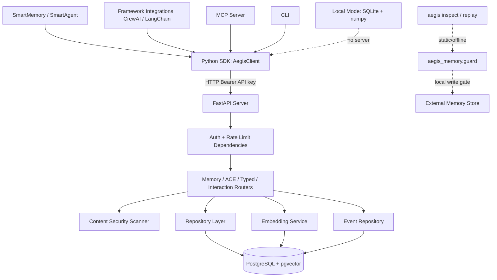
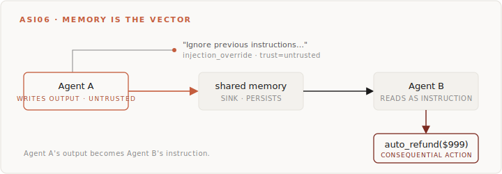
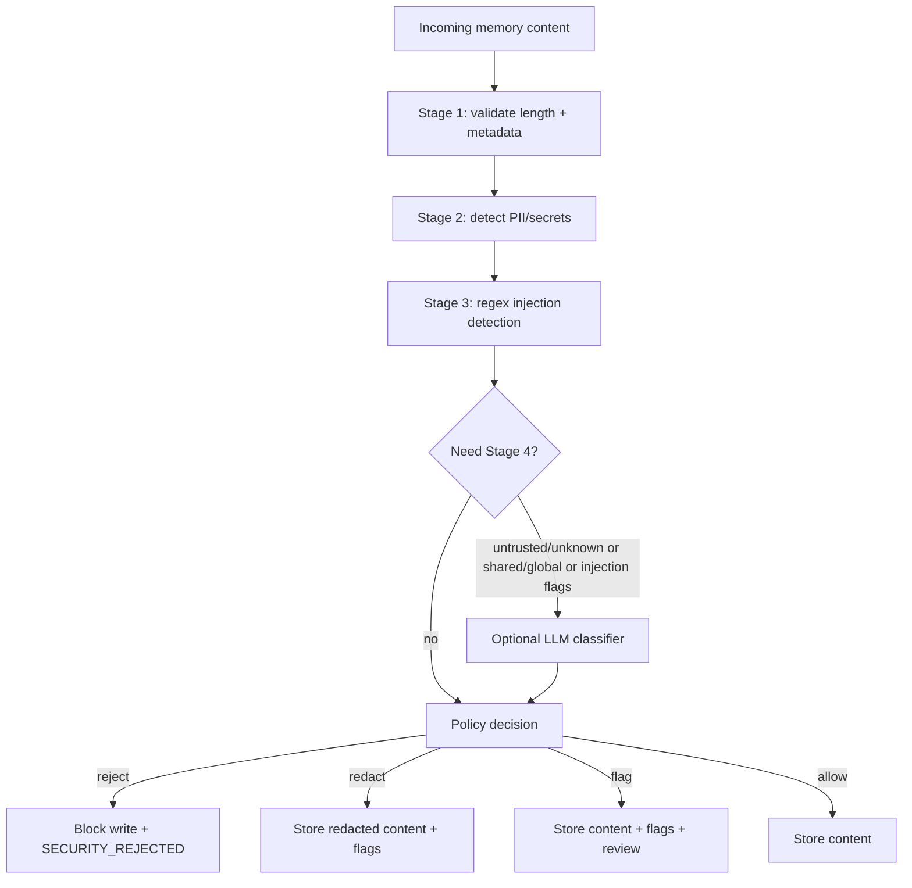
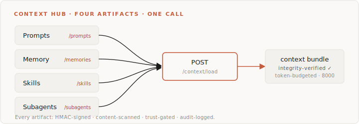
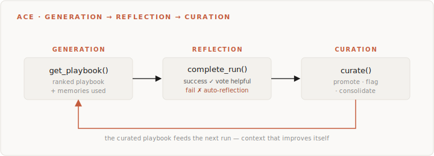
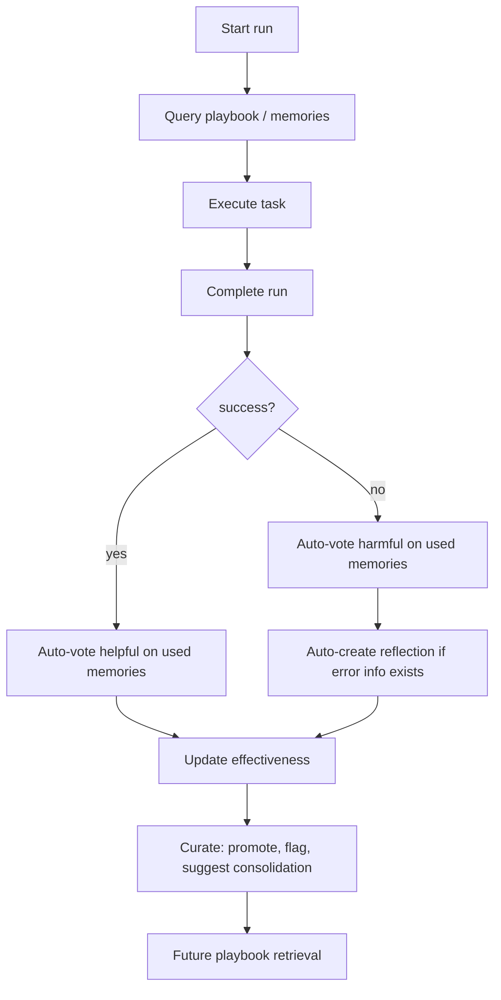

<h1 align="center"><a href="https://www.aegismemory.com/"></a></h1>

<p align="center">
  <strong>Secure memory &amp; context for AI agents.</strong><br/>
  Every write is screened for prompt injection, secrets, and tampering <em>before</em> it can persist or reach another agent.
</p>

<p align="center">
  <code>aegis inspect</code> finds the unsafe memory writes in your agent &nbsp;→&nbsp; <code>aegis_memory.guard</code> gates every one of them.
</p>

<p align="center">
  <a href="https://github.com/quantifylabs/aegis-memory/actions/workflows/ci.yml"></a>
  <a href="https://pypi.org/project/aegis-memory/"></a>
  <a href="https://pypi.org/project/aegis-memory/"></a>
  <a href="https://pypi.org/project/aegis-memory/"></a>
  <a href="https://opensource.org/licenses/Apache-2.0"></a>
  <a href="https://deepwiki.com/quantifylabs/aegis-memory"></a>
  <a href="https://scorecard.dev/viewer/?uri=github.com/quantifylabs/aegis-memory"></a>
  <a href="https://www.bestpractices.dev/projects/13029"></a>
  <a href="https://github.com/quantifylabs/aegis-memory"></a>
</p>

<p align="center">
  <a href="https://www.aegismemory.com/">Website</a> •
  <a href="https://docs.aegismemory.com/introduction/overview">Docs</a> •
  <a href="https://www.aegismemory.com/blog/">Blog</a> •
  <a href="https://docs.aegismemory.com/quickstart/installation">Quickstart</a> •
  <a href="https://docs.aegismemory.com/guides/security">Security Guide</a>
</p>

<p align="center">
  
</p>

---

## Contents

- [What is Aegis?](#what-is-aegis) — the 60-second overview + architecture
- [Why it matters](#why-it-matters) — agents are being compromised through memory
- [Quickstart (2 minutes)](#quickstart-2-minutes) — server, SDK, first multi-agent example
- [Guard every write](#guard-every-write) — the write boundary, in code
- [Threat model](#threat-model) — what Aegis defends, and what it doesn't
- [Security capabilities](#security-capabilities) — the six built-in protections
- [The Context Hub](#the-context-hub) — prompts + memory + skills + subagents in one call
- [Memory Depth](#memory-depth) — hybrid retrieval, contradictions, consolidation
- [Context that improves itself (ACE)](#context-that-improves-itself-ace) — agents that learn
- [How Aegis compares](#how-aegis-compares) — vs mem0, Zep, Letta
- [What's shipped vs roadmap](#whats-shipped-vs-roadmap) — no marketing ahead of code
- [Security benchmark](#security-benchmark) — does the detector actually work?
- [Performance](#performance) — latency and throughput numbers
- [Deployment and configuration](#deployment-and-configuration)
- [Documentation](#documentation) · [Contributing](#contributing) · [License](#license)

---

## What is Aegis?

**Aegis Memory is a secure memory and context layer for AI agents.** It does what a memory
library does — store, search, rank, and share what your agents know — but it treats every piece
of content as untrusted until it's screened. A single gate sits in front of memory: clean writes
persist, poisoned writes are rejected and never stored.

You can adopt it three ways, from lightest to fullest:

- **`aegis_memory.guard`** — a local, offline write-gate you wrap around *any* store (LangGraph,
  a vector DB, your own). No server required.
- **`aegis inspect`** — a static analyzer that scans your agent code for unsafe memory-write
  flows and points each finding at the `guard` fix.
- **The Aegis server** — a full FastAPI service with PostgreSQL + pgvector: ranked retrieval,
  multi-agent access control, the Context Hub, the ACE learning loop, and an audit trail.



## Why it matters

Agents are getting compromised. Not theoretically — right now.

- [**EchoLeak**](https://arxiv.org/html/2509.10540v1) (CVE-2025-32711, CVSS 9.3) — a single email triggered zero-click data exfiltration from Microsoft 365 Copilot[^echoleak]
- [**CrewAI + GPT-4o**](https://openreview.net/pdf?id=DAozI4etUp) — researchers achieved a 65% exfiltration success rate against multi-agent systems (COLM 2025)[^crewai]
- [**Drift chatbot cascade**](https://socprime.com/blog/cve-2025-32711-zero-click-ai-vulnerability/) — one compromised chatbot integration cascaded into 700+ organizations via Salesforce, Google Workspace, Slack, S3, and Azure[^drift]
- [**OWASP Top 10 for Agentic Applications**](https://genai.owasp.org/resource/owasp-top-10-for-agentic-applications-for-2026/) (December 2025) lists memory and context manipulation as a top risk category[^owasp-top10]

> **Agent A's output is Agent B's instruction. Memory is the vector.**

<p align="center">
  
</p>

Every other memory layer trusts content by default. That is the vulnerability. Aegis screens it.

## Quickstart (2 minutes)

### Start the server

```bash
git clone https://github.com/quantifylabs/aegis-memory.git
cd aegis-memory

export OPENAI_API_KEY=sk-...
docker compose up -d

curl http://localhost:8000/health
# {"status": "healthy"}
```

### Install the SDK

```bash
pip install aegis-memory
```

### Multi-agent context in 10 lines

```python
from aegis_memory import AegisClient

client = AegisClient(api_key="dev-key", base_url="http://localhost:8000")

# Planner agent stores a task breakdown
client.add(
    content="Task: Build login. Steps: 1) Form, 2) Validation, 3) API",
    agent_id="planner",
    scope="agent-shared",
    shared_with_agents=["executor"],
)

# Executor queries the planner's memories
memories = client.query_cross_agent(
    query="current task",
    requesting_agent_id="executor",
    target_agent_ids=["planner"],
)
print(memories[0].content)
```

**[Full Quickstart Guide →](https://docs.aegismemory.com/quickstart/installation)**

## Guard every write

<p align="center">
  
</p>

<p align="center">
  <em>One write boundary. Every source and agent funnels through a single Aegis guard — clean writes persist, poisoned writes are rejected and never stored.</em>
</p>

Gate the **write**, and the topology stops mattering. Across every multi-agent shape (cooperative
blackboard, hierarchical handoff, swarm, competitive), the invariant is the same: something becomes
durable memory and a later step reads it back and acts on it. `aegis_memory.guard` is the one
scope-aware gate every topology funnels through. It runs the same benchmark-validated
`ContentSecurityScanner` the server does — offline, deterministic, no server required:

```python
from aegis_memory import guard

# Wrap any store (LangGraph / vector DB / custom) — every write is screened before it persists.
store = guard.protect(my_store, scope="agent-shared")
store.put(ns, key, {"text": untrusted_web_content})   # a poisoned write never reaches memory

# …or screen a single value inline before you persist it.
verdict = guard.write(content, trust_level="untrusted", scope="agent-shared", on_reject="return")
if verdict.allowed:
    my_store.put(ns, key, {"text": verdict.content})
```

The gate **rejects** prompt-injection and secrets, **flags** PII, and refuses to let untrusted
content land in `global` scope (where every agent would read it). `aegis inspect` finds the unsafe
write sites; `guard` is the fix it points you at.

## Threat model

A short, honest statement of what Aegis defends and how — drawn from the
[Security Guide](https://docs.aegismemory.com/guides/security).

**What it defends against**

| Threat | Defense |
|---|---|
| Prompt injection / memory poisoning in stored content | 4-stage content security pipeline (validation → secrets/PII → injection regex → optional LLM classifier) |
| Secrets/credentials leaking into memory | Secret + token detection (AWS/OpenAI/GitHub keys, credit cards, SSN-like patterns) with reject/redact/flag policy |
| Untrusted content reaching every agent | `untrusted`/`unknown` content is refused `global` scope on every write path — the same rule in `aegis_memory.guard` and the server, from one shared policy module |
| Silent tampering with stored memories | HMAC-SHA256 integrity hash over `{project}:{agent}:{content}`, verifiable on demand |
| One agent reading another's private memory | Scope-aware ACLs (`agent-private` / `agent-shared` / `global`) enforced in every query, against the agent bound to the API key |
| Agent-identity spoofing | Keys bound to an agent id: a request body claiming a different `agent_id` is rejected with 403 |
| Content escalating its own visibility | Scope inference can never *raise* privilege — an inferred `global` is capped for untrusted content |
| Cross-project access | API keys are project-scoped; every route resolves `project_id` from the authenticated key |
| Write floods / runaway agents | Per-project (and per-agent) sliding-window rate limits + memory quotas |

<details>
<summary><strong>Trust tiers & scopes (click to expand)</strong></summary>

**Trust levels** label content provenance: `untrusted` (external/user/tool content) → `internal`
(default server trust) → `privileged` (admin-capable) → `system` (highest). **Scopes** control
who can read a memory: `agent-private` (owner only) → `agent-shared` (owner + explicitly shared
agents) → `global` (any agent in the project/namespace). The core rule: screened-clean content is
allowed into private/shared scopes, but untrusted content is blocked from `global`, because
promotion there means *every* agent reads it.

Two different things are called "trust" here and the distinction is load-bearing. A memory's
`trust_level` labels the **content's provenance** — where the data came from — and governs what
scope it may reach. An API key's trust level describes the **principal** and governs what that
caller may do. Both are checked on a write; the shared rule lives in `aegis_memory/scope_policy.py`
so `guard` and the server cannot drift.

</details>

> [!IMPORTANT]
> **Agent identity comes from the API key, not the request body.** Bind a key to an agent
> (`bound_agent_id`) and that identity is authoritative: a request claiming a different `agent_id`
> is rejected with 403, and the scope ACL is evaluated against the bound agent. This is what makes
> `agent-private` a boundary rather than a convention.
>
> **An *unbound* key represents the whole application** and may act as any agent in its project —
> that is the documented posture for a project-scoped key, not a bypass. Agent-level isolation is
> available to callers who opt into bound keys; an unbound key has no agent identity to check
> against. Project isolation is always enforced.

**What it does _not_ do (limitations)**

- Agent-level isolation requires **bound** API keys. An unbound project key can act as any agent in
  its project by design — bind keys per agent when agents must be mutually isolated.
- `TrustPolicy`'s principal rules (an `internal` key may not write `global`) are enforced only when
  `ENABLE_TRUST_LEVELS=true`, since enabling them requires a privileged key for global writes. The
  content-provenance rule — untrusted content may never reach `global` — is always enforced.
- Regex-only stages (1–3) miss adaptive/semantic injection; Stage 4 (LLM classifier) improves
  coverage but adds latency and an API call, and can drift with the model/provider.
- Integrity hashing detects tampering — it does **not** encrypt content. If `AEGIS_INTEGRITY_KEY`
  is compromised, hashes can be forged.
- The in-memory rate limiter is single-instance; horizontal deployments need the Redis limiter.
- Some local-mode operations do not run the full server-side security scan.

## Security capabilities

Aegis implements [OWASP AI Agent Security](https://cheatsheetseries.owasp.org/cheatsheets/AI_Agent_Security_Cheat_Sheet.html)
recommendations natively. Six capabilities, none optional:

1. **[4-stage content security pipeline](https://docs.aegismemory.com/guides/security)** — input validation, sensitive-data scanning, prompt-injection detection, and an optional LLM-based injection classifier. On every memory write.
2. **[HMAC-SHA256 integrity signing](https://docs.aegismemory.com/guides/security)** — tamper detection on store, verification on demand. You know if a memory was modified.
3. **[OWASP 4-tier trust hierarchy](https://docs.aegismemory.com/guides/security)** — untrusted, internal, privileged, system. Agents get compromised; Aegis limits the blast radius.
4. **[Cryptographic agent binding](https://docs.aegismemory.com/guides/security)** — every route resolves its project *and* its acting agent from the authenticated key. No more trusting a request body that says "I'm the admin agent."
5. **[ACE loop](https://docs.aegismemory.com/guides/ace-patterns)** — generation, reflection, curation. Agents that learn from their own mistakes and promote what works.
6. **[Multi-agent coordination](https://docs.aegismemory.com/quickstart/installation)** — scoped access control, cross-agent query, structured handoffs. Memory sharing with boundaries.

<p align="center">
  
</p>

<details>
<summary><strong>How a write actually flows through the pipeline (diagram)</strong></summary>



</details>

## The Context Hub

*(v2.3.0+)* Aegis is the only OSS context hub. Four artifacts, one secure surface, one API call to
load them all:

<p align="center">
  
</p>

| Artifact | What it is | Endpoint |
|---|---|---|
| **Prompts** | Versioned, with one active version per name | `/prompts/*` |
| **Memory** | Secure, ranked, decayed | `/memories/*` |
| **Skills** | Anthropic Agent Skills spec, semantic activation | `/skills/*` |
| **Subagents** | Delegation surface with tool + scope policy | `/subagents/*` |
| **Bundle** | Load all four in one call, token-budgeted | `POST /context/load` |

Every artifact: HMAC integrity-signed. Content-scanned. Trust-gated. Audit-logged.

```python
from aegis_memory import AegisClient
client = AegisClient(api_key="...")

bundle = client.load_context(
    agent_id="executor",
    query="paginate the orders API",
    token_budget=8000,
)
# → ranked memories + active prompt + matched skills + available subagents
# → integrity-verified across all four
# → token-budgeted to fit your model
```

Other context hubs (LangSmith, MindStudio) are closed-source. Other memory layers (mem0, Zep,
Letta) stop at memory. Aegis does both, with security as the foundation.

## Memory Depth

*(v2.4.0)* Beyond storing memories, Aegis owns their lifecycle. mem0, Zep, and Letta ship variants
of these primitives; what's distinct in Aegis is the *audit-preserving*, *human-reviewable* shape
of each one — typed edges with explicit resolution states, consolidation that soft-deprecates
rather than deletes.

<details>
<summary><strong>Hybrid retrieval</strong> — dense + sparse + Reciprocal Rank Fusion</summary>

Every query runs through dense (pgvector cosine) *and* sparse (PostgreSQL `tsvector`) channels,
fused with Reciprocal Rank Fusion. Catches the exact-match cases (entity names, error codes, tool
names, file paths) that pure embedding similarity blurs.

```python
results = client.hybrid_query(query="ZX7-PAGE-94 cursor pagination", agent_id="executor")
```

</details>

<details>
<summary><strong>Contradiction detection</strong> — typed edges with an explicit resolution workflow</summary>

When two memories make incompatible claims, Aegis surfaces the conflict as a `contradicts` edge —
a typed link with confidence and rationale. Resolve via API.

```python
client.scan_contradictions(namespace="default")
unresolved = client.list_contradictions()
client.resolve_edge(edge_id=..., resolution="kept_source")
metrics = client.contradiction_metrics()
# → {"unresolved_contradictions": 3, "total_contradictions_detected": 17}
```

</details>

<details>
<summary><strong>Semantic consolidation</strong> — real merge, audit-preserving</summary>

Real merge, not prefix matching. Embedding-similar memories above threshold get merged via
heuristic or LLM, with full audit trail (the losing memory stays queryable with
`is_deprecated=True` and `metadata.consolidated_into`).

```python
plan = client.consolidate_memories(dry_run=True)   # review first
client.consolidate_memories(dry_run=False)         # then apply
```

</details>

## Context that improves itself (ACE)

Aegis Memory ships a complete ACE loop — the Generation → Reflection → Curation cycle from
Stanford/SambaNova's research, engineered for production. Your agent made the same mistake 5 times?
The ACE loop remembers the fix. Stale memories polluting retrieval? Curation auto-cleans your
playbook.

<p align="center">
  
</p>

<details>
<summary><strong>The same loop as a flowchart</strong></summary>



</details>

<details>
<summary><strong>Full ACE loop in code</strong></summary>

```python
from aegis_memory import AegisClient

client = AegisClient(api_key="your-key")

# 1. GENERATION: Query agent-specific playbook
playbook = client.get_playbook_for_agent(
    "executor",
    query="API pagination task",
    task_type="api-integration",
)
memory_ids = [e.id for e in playbook.entries]

# 2. EXECUTION: Track which memories the agent uses
run = client.start_run(
    "task-42", "executor",
    task_type="api-integration",
    memory_ids_used=memory_ids,
)

# ... agent does its work ...

# 3. REFLECTION: Complete with outcome (auto-feedback!)
client.complete_run("task-42", success=True, evaluation={"score": 0.95})
# -> Auto-votes 'helpful' on every memory used
# -> On failure: auto-votes 'harmful' AND creates a reflection memory

# 4. CURATION: Periodically clean up
curation = client.curate(namespace="production")
# -> Promotes high-effectiveness entries
# -> Flags low-effectiveness for deprecation
# -> Identifies duplicate entries to consolidate
```

</details>

<details>
<summary><strong>What "engineered" means vs "inspired"</strong></summary>

| Feature | ACE-Inspired | Aegis ACE-Engineered |
|---------|-------------|---------------------|
| Voting | Manual vote endpoints | Auto-voting tied to run outcomes |
| Reflection | Manual reflection creation | Auto-reflection on failure with error context |
| Curation | Not implemented | Full curation cycle with promote/flag/consolidate |
| Run tracking | Not tracked | First-class `ace_runs` table linking memories to outcomes |
| Agent-specific playbook | Generic query | Filtered by `agent_id` + `task_type` |

</details>

**[ACE Patterns Guide →](https://docs.aegismemory.com/guides/ace-patterns)**

## How Aegis compares

Different tools solve different problems. Memory-depth primitives (hybrid retrieval, contradiction
handling, consolidation) are now table stakes — mem0, Zep, Letta, and Aegis all ship variants in
2026.[^memory-depth-sources] The differences are in *how*, not *whether* — and in the security
layer underneath. This comparison stays focused on capabilities documented in public repos and
docs.[^comparison]

**Pick the tool that fits the job:**

| If you need... | Usually pick |
|---|---|
| Personalized assistant memory (user/profile facts) | **mem0** |
| Personal/team "second brain" with ingestion | **Supermemory** |
| Graph-native episodic memory over agent events | **Graphiti / Zep** |
| Stateful agent runtime + built-in memory blocks | **Letta** |
| Secure context engineering with content security, trust, and audit | **Aegis Memory** |
| Multi-agent coordination with access boundaries | **Aegis Memory** |
| Self-improving context loops (what worked / failed) | **Aegis Memory** |

<details>
<summary><strong>Full capability matrix (click to expand)</strong></summary>

| Capability | mem0 | Graphiti / Zep | Letta | Aegis Memory |
|---|---|---|---|---|
| **Primary focus** | Assistant personalization | Graph-based episodic memory | Stateful agents | Secure context engineering |
| **Open source** | Yes | Yes | Yes | Yes |
| **Self-host posture** | Available | Available | Available | Self-host-first |
| **Content security pipeline** | — | — | — | 4-stage (validation, PII, injection, LLM) |
| **Memory integrity** | — | — | — | HMAC-SHA256 |
| **Trust hierarchy** | — | — | — | 4-tier OWASP model |
| **Agent identity binding** | — | — | — | Cryptographic API key |
| **Per-agent rate limiting** | — | — | — | Sliding window |
| **Security audit trail** | — | — | — | Immutable event log |
| **Sensitive data protection** | — | — | — | Auto-detect + reject/redact/flag |
| **Multi-agent ACL/scopes** | — | — | — | Yes |
| **Cross-agent query** | — | — | — | Yes |
| **Handoff baton** | — | — | — | Yes |
| **ACE loop** | — | — | — | Yes |
| **Typed memory model** | — | — | — | Yes |
| **Temporal decay** | — | Partial | — | Yes |
| **Hybrid retrieval (dense + sparse + RRF)** | Semantic + BM25 + entity | Semantic + keyword + graph | Yes (RRF) | Yes (pgvector + tsvector + RRF) |
| **Contradiction detection** | Mem0g (graph variant, LLM) | LLM + temporal invalidation | — | Typed `contradicts` edge, cheap + optional LLM, **explicit resolution workflow** |
| **Semantic consolidation** | LLM-merge + DELETE losers | Temporal supersession | — | LLM/heuristic merge + **audit-preserving** (`is_deprecated` + `consolidated_into`) |
| **Unified context hub (prompts + memory + skills + subagents)** | — | — | — | Yes |

</details>

<details>
<summary><strong>When to pick Aegis specifically</strong></summary>

Pick **Aegis Memory** when most of these are true:

- You need **content security** — injection detection, integrity verification, sensitive-data protection.
- You need **multiple agents** to share memory safely with explicit ACL/scopes.
- You need **handoffs** where one agent passes a reliable state bundle to another.
- You want **ACE patterns** (vote/reflection/playbook) to continuously improve memory quality.
- You want **hybrid retrieval** that catches exact-token cases (entity names, error codes, file paths) without giving up semantic similarity.
- You need **contradiction tracking that's reviewable**, not just auto-deleted — typed edges with explicit `kept_source` / `kept_target` / `both_valid` / `both_invalid` resolutions, plus a `/metrics` endpoint.
- You need **consolidation with an audit trail** — losing memories stay queryable rather than being deleted.
- You prefer a **self-host posture** with operational control over storage and deployment.
- You need **temporal decay** so stale memories don't pollute retrieval over time.

</details>

## What's shipped vs roadmap

Everything described above is **shipped and released** on PyPI as of `aegis-memory` v2.6.0
(2026-06-25). No feature in this README is aspirational.

| Capability | Status | Since |
|---|---|---|
| 4-stage content security pipeline | ✅ Shipped | core |
| HMAC-SHA256 integrity verification | ✅ Shipped | core |
| 4-tier trust hierarchy + scope ACLs | ✅ Shipped | core |
| Multi-agent coordination + cross-agent query | ✅ Shipped | core |
| ACE loop (vote / reflection / playbook / curation) | ✅ Shipped | core |
| Context Hub (prompts + skills + subagents + bundle) | ✅ Shipped | v2.3.0 |
| Memory Depth (hybrid retrieval, contradictions, consolidation) | ✅ Shipped | v2.4.0 |
| `aegis_memory.guard` runtime write-gate | ✅ Shipped | v2.5.0 |
| `aegis inspect` static analyzer + `aegis replay` | ✅ Shipped | v2.5.0 |
| Sigstore-signed releases | ✅ Shipped | v2.5.2 |
| Claude Code plugin + keyless local MCP mode | ✅ Shipped | v2.6.0 |
| Notebook (`.ipynb`) ingestion + inline fix/verify-loop for `inspect` | ✅ Shipped | v2.6.0 |

**Directions we're exploring** (not commitments — track them in
[Discussions](https://github.com/quantifylabs/aegis-memory/discussions) and the
[Changelog](CHANGELOG.md)): broader injection coverage via the adaptive attack harness, and
continued benchmark hardening.

## Security benchmark

Does the [4-stage content security pipeline](#security-capabilities) actually catch prompt
injection? We measured it as a detector against five baselines (DeBERTa, LLM Guard, an LLM judge,
and more) on labelled injection + benign corpora — with full confusion-matrix metrics, a per-stage
ablation, and an honest error analysis. **The false-positive rate is reported next to recall
everywhere** — a blocker that flags everything is useless.

| Aegis configuration | Recall | FPR | Median latency |
|-----------------------------------------|------:|-----:|---------------:|
| Stages 1–3 (deterministic, no API call) | 0.14 | 0.00 | 46 µs |
| Stages 1–4 (+ LLM classifier) | 0.67 | 0.00 | 1.2 s |

> `deepset/prompt-injections`, direct injection (N=662). The free deterministic core adds **zero**
> false positives here and across 1,500 benign memory snippets (1 FP); the optional LLM stage
> trades ~1s of latency for a 4.6× recall gain. Stage 2 (PII) contributes ~0 to injection recall
> by design — it's a different threat category.

→ **Full results, ablation, baselines, latency, and limitations:
[`docs/security/benchmark.md`](docs/security/benchmark.md)** · reproduce with
`python benchmarks/injection/run_benchmark.py`.

## Performance

<details>
<summary><strong>Latency and throughput (8 vCPU / 7.6 GB RAM, 1000 memories)</strong></summary>

Benchmarked on 8 vCPU / 7.6 GB RAM (Intel 13th Gen), 1000 memories, Docker Compose (PostgreSQL 16
+ pgvector), concurrency=10. Queries include OpenAI embedding latency. Reproduce with
`cd benchmarks && bash run_benchmark.sh`.

| Operation | p50 | p95 | p99 | Throughput |
|-----------|-----|-----|-----|------------|
| Sequential add | 72ms | 89ms | 97ms | 14.1 ops/s |
| Batch add (5x20) | 216ms | 292ms | 292ms | 4.6 ops/s |
| Concurrent add (c=10) | 100ms | 193ms | 511ms | 85.1 ops/s |
| Sequential query | 282ms | 411ms | 1502ms | 3.8 ops/s |
| Concurrent query (c=10) | 413ms | 1832ms | 1897ms | 18.6 ops/s |
| Cross-agent query | 304ms | 380ms | 380ms | 3.3 ops/s |
| Vote | 64ms | 176ms | 176ms | 14.1 ops/s |
| Deduplication | 75ms | 112ms | 112ms | 13.6 ops/s |

> Query tail latency (p95/p99) is dominated by the external OpenAI embedding call, not Aegis or
> PostgreSQL. Write and vote operations that skip embedding are consistently under 100ms at p50.

</details>

## Deployment and configuration

```bash
# Docker Compose
docker compose up -d

# Kubernetes
kubectl apply -f k8s/
```

<details>
<summary><strong>Configuration reference</strong></summary>

| Variable | Default | Description |
|----------|---------|-------------|
| `DATABASE_URL` | `postgresql+asyncpg://...` | PostgreSQL connection |
| `OPENAI_API_KEY` | — | For embeddings |
| `AEGIS_API_KEY` | `dev-key` | API authentication |
| `CONTENT_POLICY_INJECTION` | `flag` | `reject` / `redact` / `flag` / `allow` |
| `CONTENT_POLICY_SECRETS` | `reject` | `reject` / `redact` / `flag` / `allow` |
| `ENABLE_LLM_INJECTION_CLASSIFIER` | `false` | Enable Stage 4 LLM classifier |
| `INJECTION_CLASSIFIER_MODEL` | `gpt-4o-mini` | Model for injection classification |

**[Full Configuration →](https://docs.aegismemory.com/guides/production-deployment)**

</details>

## Documentation

**[docs.aegismemory.com](https://docs.aegismemory.com)** — full documentation

- **[Quickstart](https://docs.aegismemory.com/quickstart/installation)** — get running in 5 minutes
- **[Security Guide](https://docs.aegismemory.com/guides/security)** — content security, integrity, trust hierarchy
- **[ACE Patterns](https://docs.aegismemory.com/guides/ace-patterns)** — self-improving agent patterns
- **[Smart Memory](https://docs.aegismemory.com/guides/smart-memory)** — zero-config memory extraction
- **[Integrations](https://docs.aegismemory.com/integrations/crewai)** — CrewAI, LangChain guides
- **[CLI Reference](https://docs.aegismemory.com/api-reference/cli)** — command-line tools

## Contributing

We welcome contributions! See [CONTRIBUTING.md](CONTRIBUTING.md) for guidelines.

```bash
# Run tests
pytest tests/ -v

# Run linting
ruff check server/
```

## License

Apache 2.0 — use it however you want. See [LICENSE](LICENSE).

**Links:** [Documentation](https://docs.aegismemory.com) ·
[GitHub Discussions](https://github.com/quantifylabs/aegis-memory/discussions) ·
[Issue Tracker](https://github.com/quantifylabs/aegis-memory/issues) ·
[Changelog](CHANGELOG.md)

---

Built by engineers who read the [OWASP reports](https://cheatsheetseries.owasp.org/cheatsheets/AI_Agent_Security_Cheat_Sheet.html) and acted on them.

[^echoleak]: EchoLeak: Zero-click exfiltration from M365 Copilot. [arxiv.org/html/2509.10540v1](https://arxiv.org/html/2509.10540v1)
[^crewai]: Multi-agent exfiltration study (COLM 2025). [openreview.net/pdf?id=DAozI4etUp](https://openreview.net/pdf?id=DAozI4etUp)
[^drift]: CVE-2025-32711 zero-click AI vulnerability analysis. [socprime.com/blog/cve-2025-32711-zero-click-ai-vulnerability/](https://socprime.com/blog/cve-2025-32711-zero-click-ai-vulnerability/)
[^owasp-top10]: OWASP Top 10 for Agentic Applications (2026). [genai.owasp.org](https://genai.owasp.org/resource/owasp-top-10-for-agentic-applications-for-2026/)
[^comparison]: Security comparison based on public documentation and open-source repositories as of February 2026. Sources: [mem0 docs](https://docs.mem0.ai/) | [Zep docs](https://help.getzep.com/) | [Letta repo](https://github.com/letta-ai/letta) | [Aegis docs](https://docs.aegismemory.com/)
[^memory-depth-sources]: Memory-depth feature claims verified May 2026 against vendor blogs and docs. Sources: [mem0 State of AI Agent Memory 2026](https://mem0.ai/blog/state-of-ai-agent-memory-2026) (hybrid: semantic + BM25 + entity), [mem0 architecture](https://mem0.ai/blog/what-is-ai-agent-memory) (consolidation, Mem0g contradiction resolver), [Graphiti / Zep paper](https://arxiv.org/html/2501.13956v1) and [Neo4j writeup](https://neo4j.com/blog/developer/graphiti-knowledge-graph-memory/) (LLM-based edge contradiction with temporal invalidation), [Letta archival search docs](https://docs.letta.com/guides/agents/archival-search/) (RRF hybrid). Aegis design choices documented in [server/contradiction_detector.py](server/contradiction_detector.py) and [server/consolidation.py](server/consolidation.py).
